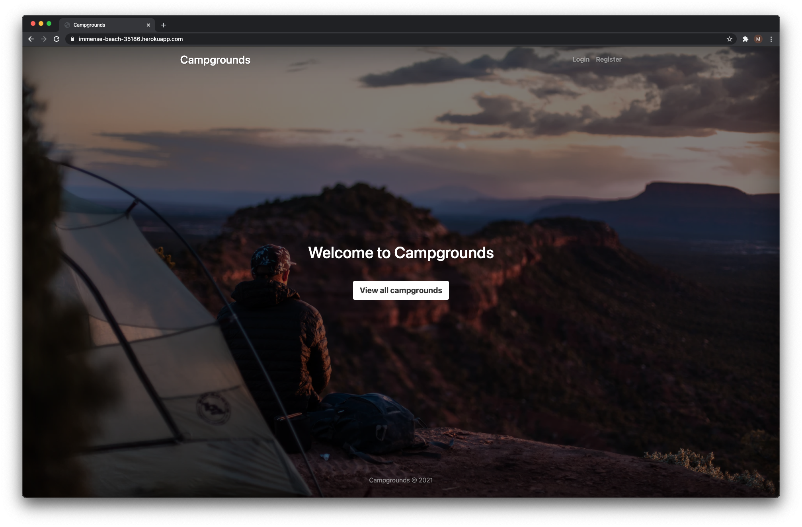
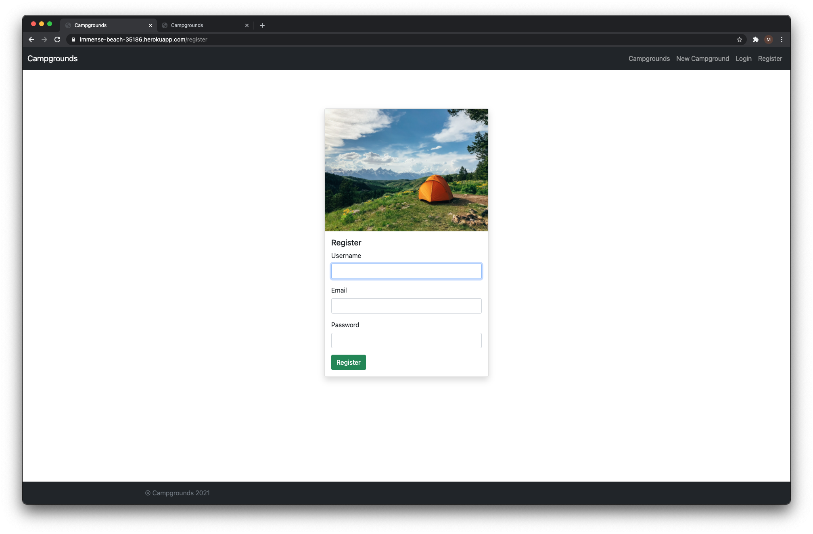
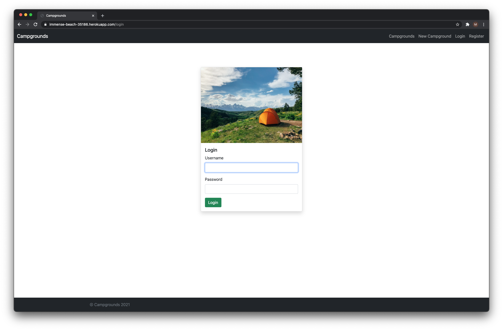
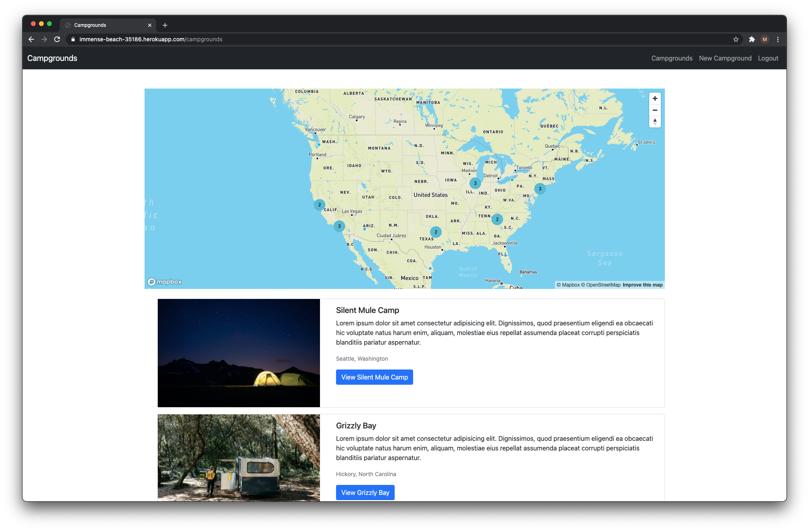
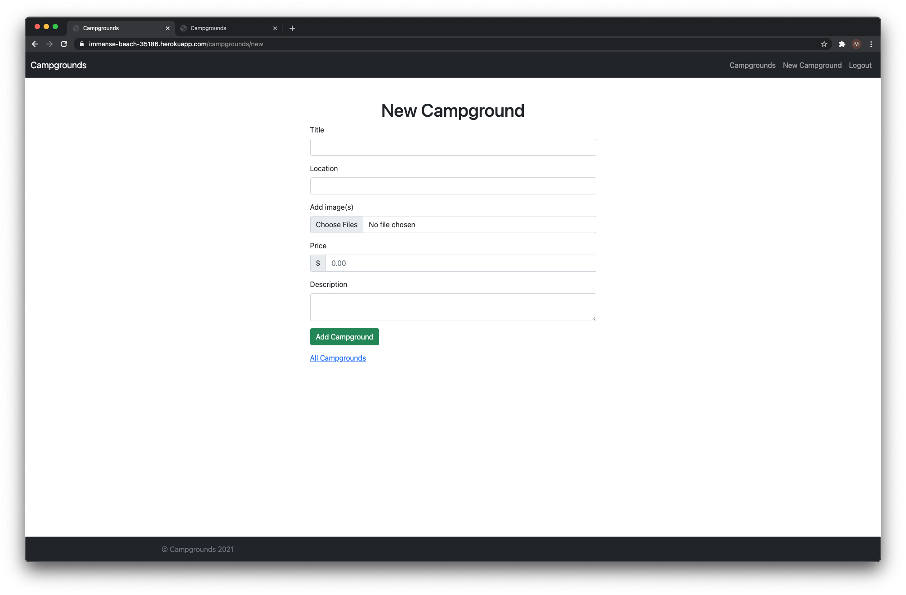
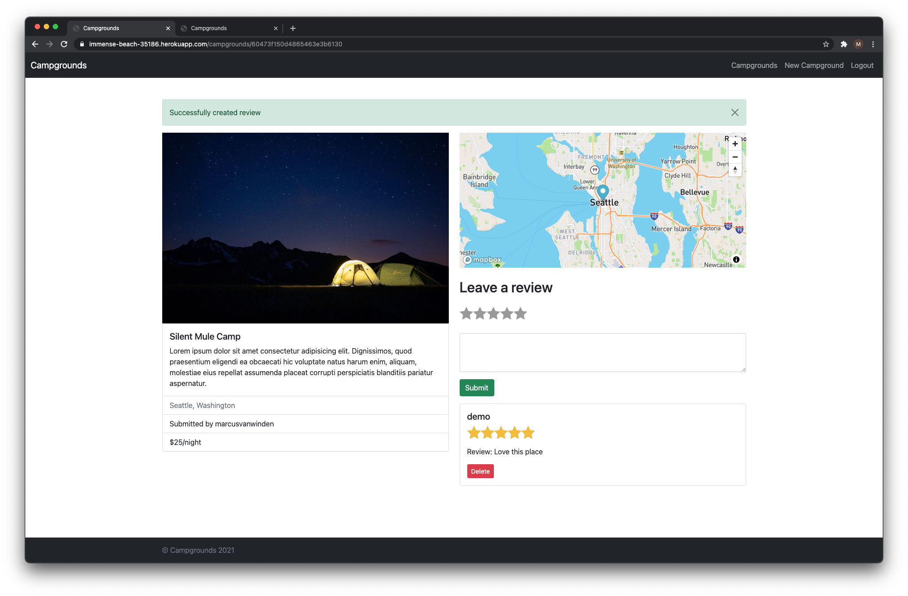

<h1>Campgrounds</h1>

View project on Chrome

<a href="https://immense-beach-35186.herokuapp.com">View project</a>

Campgrounds is a platform on which people can upload, view, and comment on campgrounds. I love camping and hiking, and so I decided to built a small project with <b>Node</b>, <b>Express</b>, and <b>MongoDB</b>. The project is a work in progress because I regularly add new or optimize existing code. Feel free to use '<b>demo</b>' and '<b>password</b>' as the username and password, respectively to see all features in the app.

<table>
  <tr>
    <th>Landing Page</th>
    <th>Create an Account</th>
  </tr>
  <tr>
    <td></td>
    <td></td>
  </tr>
  <tr>
    <th>Log In</th>
    <th>View Campgrounds</th>
  </tr>
  <tr>
    <td></td>
    <td></td>
  </tr>
  <tr>
    <th>Create New Campgrounds</th>
    <th>Add Comments</th>
  </tr>
  <tr>
    <td></td>
    <td></td>
  </tr>
</table>

<h2>Features</h2>
<ul>
  <li>Sign up, sign in, and sign out.</li>
  <li>Create, update, and delete campgrounds.</li>
  <li>View campgrounds on a map and in detail.</li>
  <li>Write reviews.</li>
  <li>User authorization.</li>
</ul>

<h2>Tech Stack</h2>
<ul>
  <li>Node</li>
  <li>Mapbox</li>
  <li>Cloudinary</li>
  <li>MongoDB</li>
  <li>Mongoose</li>
  <li>Express</li>
  <li>EJS templates</li>
  <li>Passport</li>
</ul>
